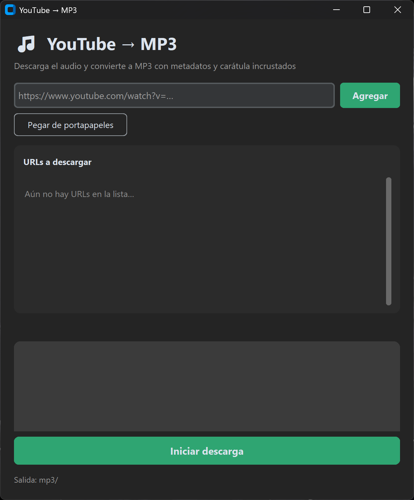

# YouTube → MP3

Descarga el audio de videos de YouTube y lo convierte a **MP3 (192 kbps)** con los metadatos y la carátula incrustados, usando `yt-dlp` + `ffmpeg` en un solo paso.

## Características

- **CLI flexible**: pasar una URL directa o un archivo `.txt` con una lista de URLs
- **Interfaz gráfica** moderna con `customtkinter` (`--ui`): tema oscuro, barra de progreso y log en vivo
- **Metadatos automáticos**: incrusta título, artista y carátula en el MP3
- **Detección de canción**: avisa cuando la fuente reporta `track`/`artist`
- **Cancelación limpia**: Ctrl+C interrumpe con resumen parcial y código de salida 130, sin tracebacks

## Requisitos

- Python 3.12+
- `ffmpeg` en el PATH (requerido por la conversión e incrustación de metadatos)
- `uv` (gestor de entornos)

## Instalación

```bash
uv sync
```

## Uso

```bash
# URL única
uv run main.py "https://www.youtube.com/watch?v=..."

# Lista desde archivo .txt (una URL por línea, ignora vacías y #)
uv run main.py -f lista.txt

# Interfaz gráfica
uv run main.py --ui
```

Ejemplo de `lista.txt`:

```
# comentario opcional
https://www.youtube.com/watch?v=dQw4w9WgXcQ
https://www.youtube.com/watch?v=otrasURLs
```

Los MP3 se guardan en la carpeta `mp3/`.

## Interfaz gráfica



## Estructura del proyecto

```
main.py       Punto de entrada (invoca el CLI)
cli.py        Configuración del CLI (argparse) y lógica de descarga
youtube.py    Descarga + conversión a MP3 con yt-dlp
gui.py        Interfaz gráfica (customtkinter)
```

## Notas

- El directorio de salida (`mp3/`, `downloads/`) y los entornos virtuales están en `.gitignore`.
- En YouTube no suelen venir etiquetas `track`/`artist`, por lo que la UI reporta "Contenido genérico"; aun así se incrustan título y carátula. En otras plataformas soportadas por yt-dlp se detecta "Canción detectada".